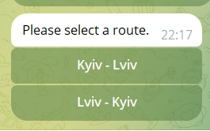

# Bus Tickets API Service

API service for creating bus routes and buying tickets, written on DRF.

## Installing / Getting started

```shell
git clone https://github.com/Anastasia-Su/bus_tickets_api.git
cd bus_tickets_api
python -m venv venv
venv\Scripts\activate (on Windows)
pip install -r requirements.txt
```  

Install Postgres and create db.
Create .env file and set it according to .env.sample:  

```shell
set SECRET_KEY=<your Django settings secret key>

set POSTGRES_HOST=<your host name, i.e. localhost>
set POSTGRES_DB=<your database>
set POSTGRES_USER=<your usernane>
set POSTGRES_PASSWORD=<your password>

set TELEGRAM_BOT_TOKEN=<your bot token>
set EMAIL_HOST=<i.e. smtp.gmail.com>
set EMAIL_PORT=<port number>
set EMAIL_USE_TLS=<boolean value>
set EMAIL_HOST_USER=<email to send notifications from>
set EMAIL_HOST_PASSWORD=<email password>
```
Run commands:
```shell
python manage.py migrate
python manage.py collectstatic
python manage.py runserver
```  

If you want to use admin panel, create a superuser:   
type `python manage.py createsuperuser`.  

## Telegram bot
Create a bot using BotFather and add its token to .env file.
Run the bot:  

```shell
- python manage.py start_bot
```

#### Workflow
* Enter `/start`command to start the bot.  
You will see a greeting message with commands.   


* If you choose to display available tickets, you will be prompted to select a route.  
  

* Then you will see a grid with tickets.  
  

* If you click an available seat to buy, you will be prompted to enter your email and then a verification code.  
After it, you should confirm or cancel your order.  
  

* If you confirm, the ticket will be sent to your email.  
  

* You can also see what tickets you have already purchased, if any.  
  

## Frontend  

You have static webpage, that pulls ticket and route data from db.  
   

## Features

* Admin panel: `/admin/`
* Documentation: `api/doc/swagger/` and `api/doc/redoc/`
* CRUD for routes
* CRUD for tickets
* Telegram bot
* Filter tickets
* Frontend (Django) integration

## Tests
Run tests: `python manage.py test`

## Links  

- Deployed project: http://164.92.238.217/
- Telegram bot: http://t.me/tickets_notification_bot

